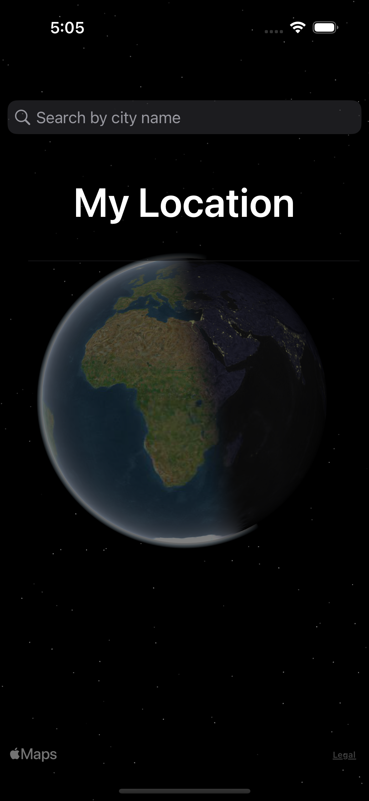
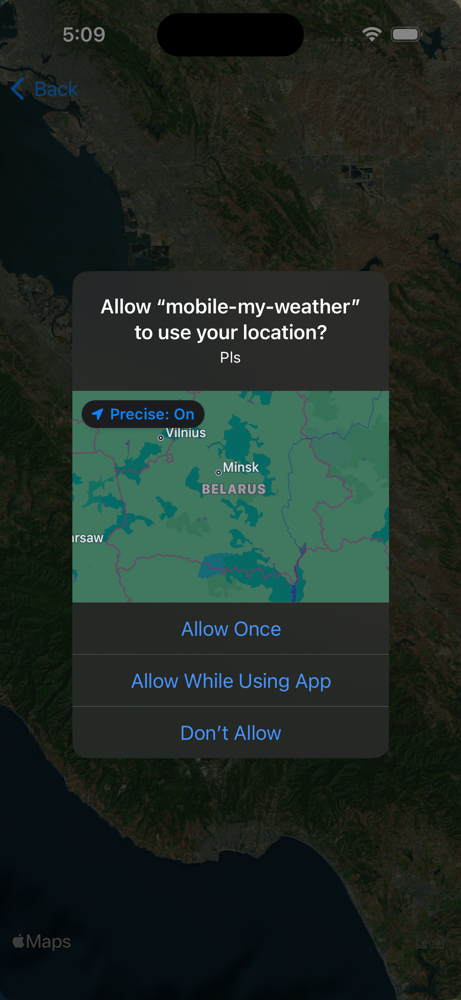
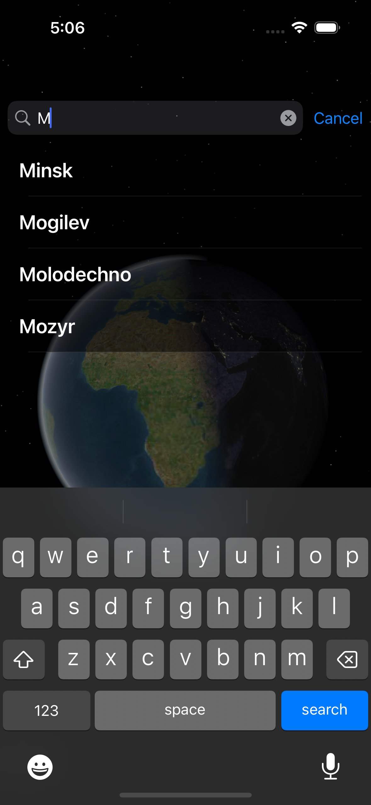
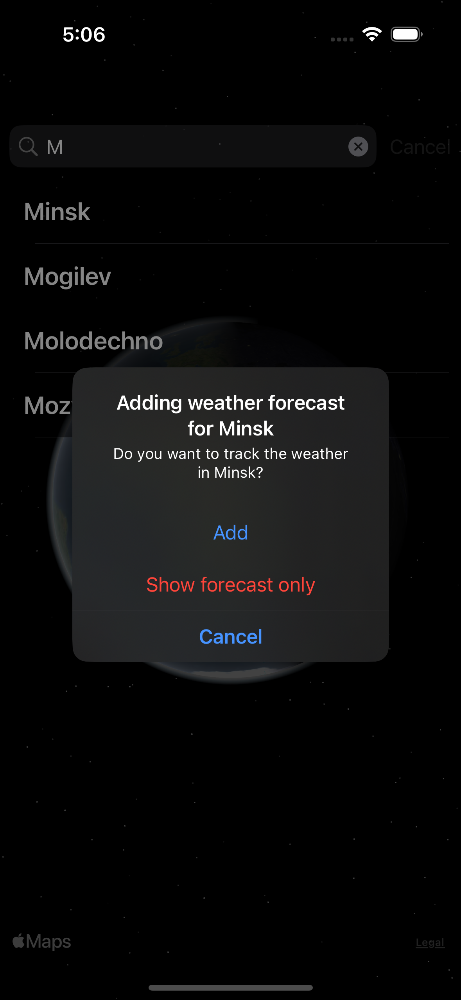
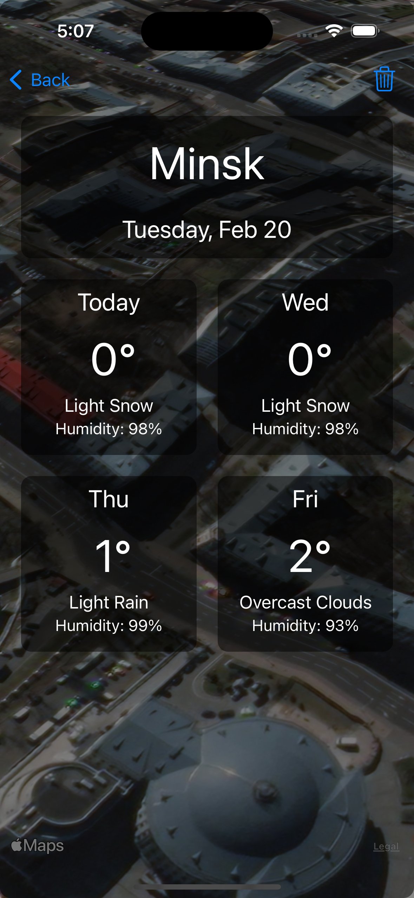
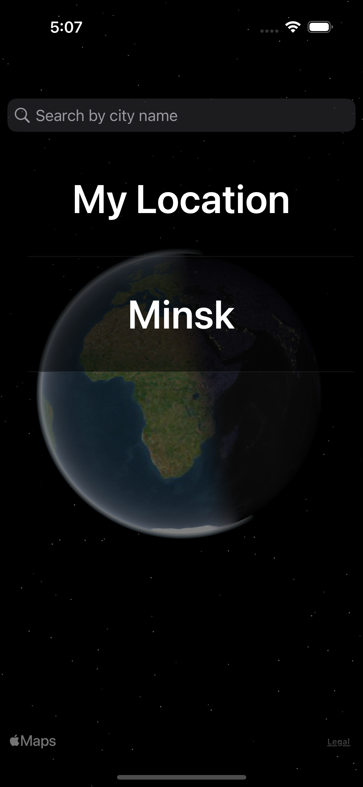
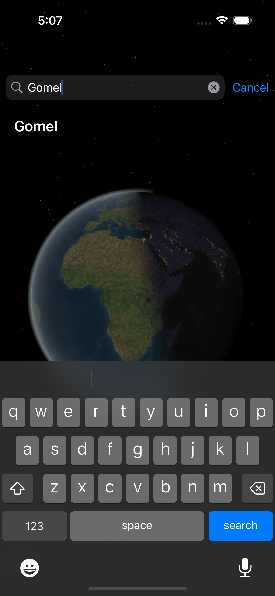
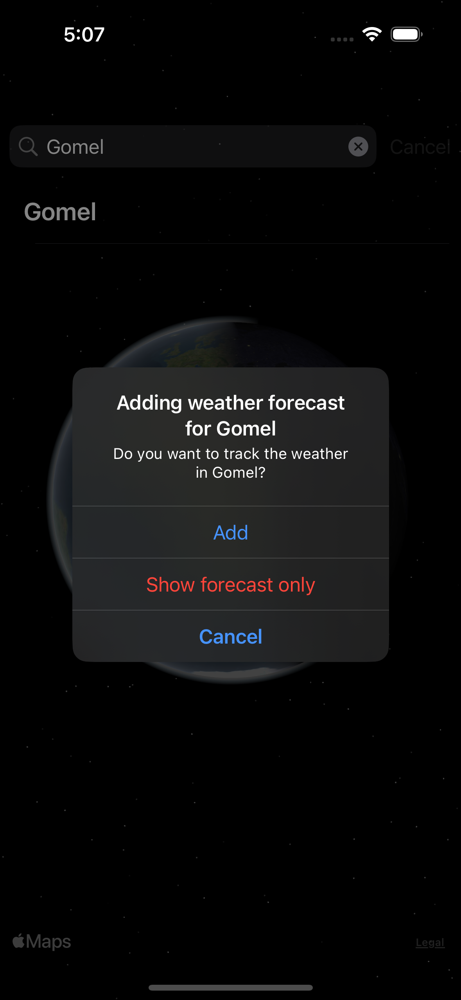
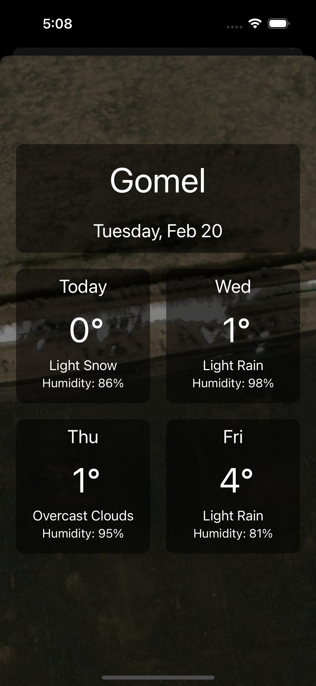

# My Weather

My Weather is a user-friendly iOS weather application that allows users to track weather information for their current location and other added cities. The app provides a convenient city search bar for easy access to weather updates.

## Screens

### 1. Main Screen

The main screen displays the user's current location and any additional cities they have added to track the weather. Key features include:

- Display of current location weather information
- List of added cities with weather updates
- City search bar for tracking weather in new locations

### 2. Weather Details Screen

When a user selects a city or their current location, a detailed weather screen opens up. This screen provides the following information:

- Temperature for the selected location
- Humidity level
- Four-day weather forecast

## Screenshots

## Requirements

- iOS 14.0+
- Xcode 12.0+
- Swift 5.0+
- Pods

## Installation

1. Clone the repository:

git clone git@github.com:your-username/my-weather-app.git

2. Install pods:

pod install

3. Open the project in Xcode.

4. Build and run the app on the iOS simulator or a physical device.

## Contributing

Contributions are encouraged! If you have any feedback, ideas, or bug reports, please feel free to open an issue or submit a pull request.

## License

This project is licensed under the [MIT License](LICENSE).
